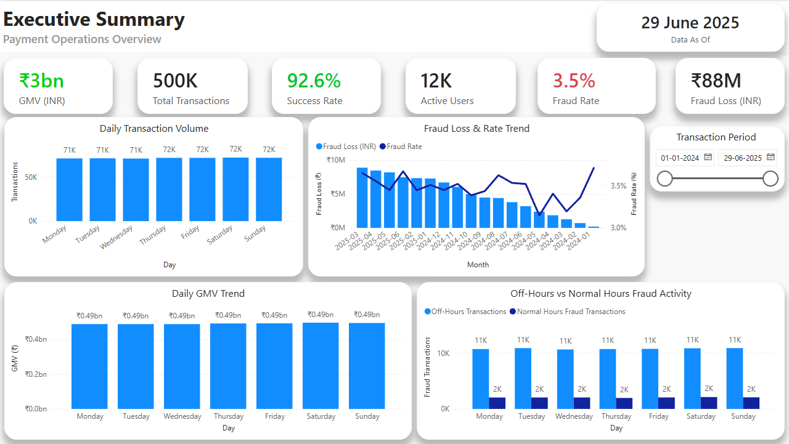
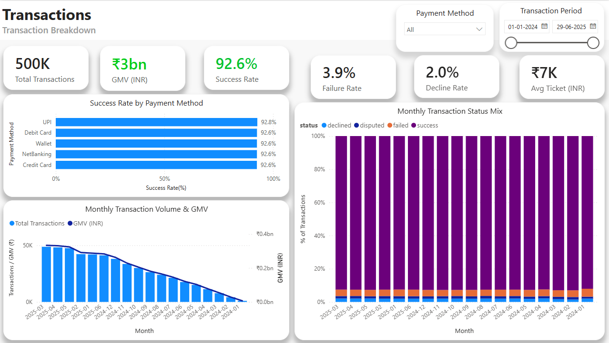
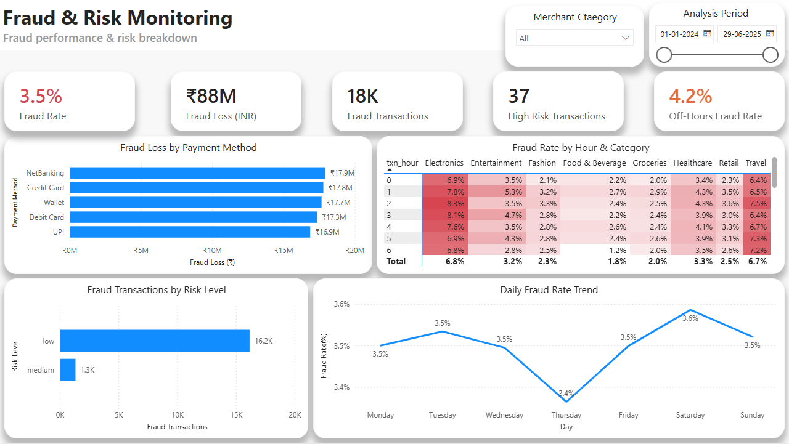
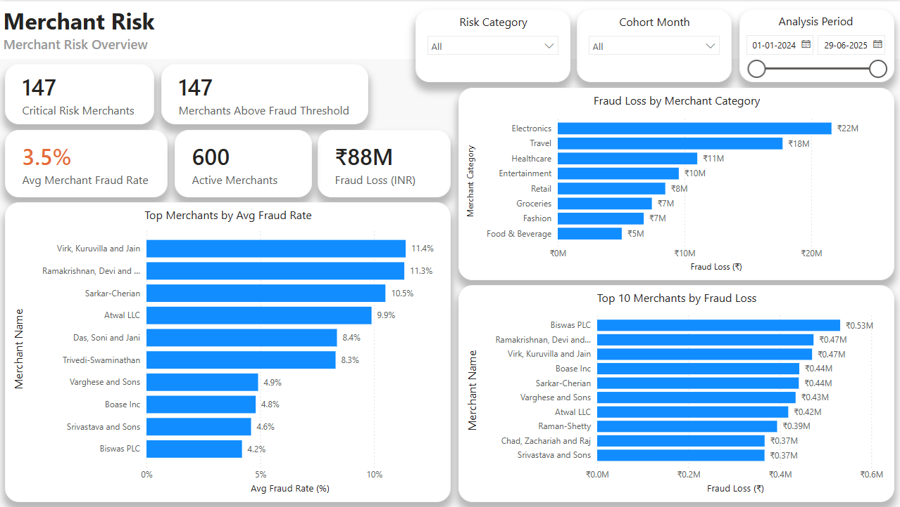
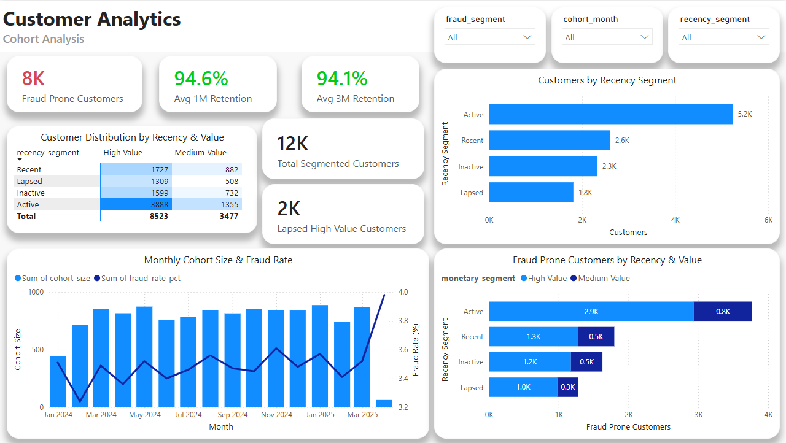
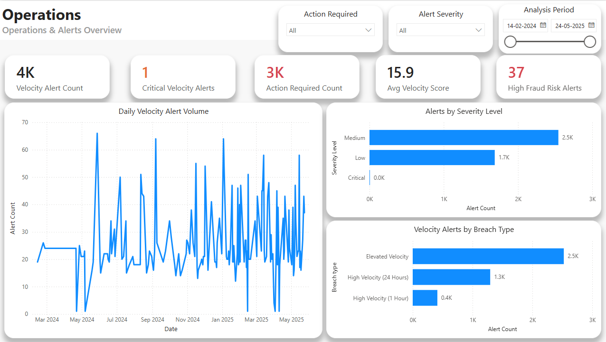
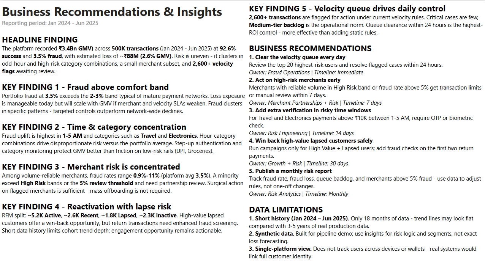
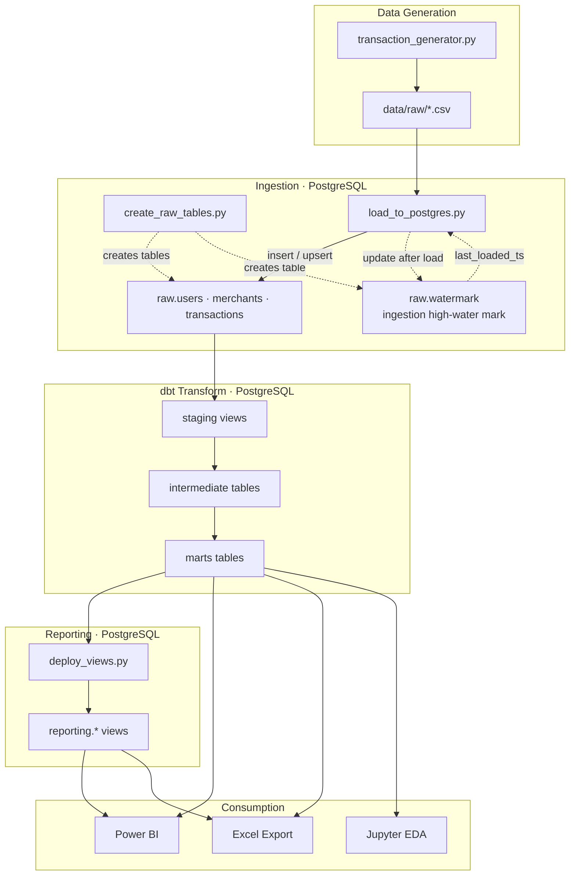

# Payment Transaction Analytics Platform

A **payments analytics platform** on synthetic Indian transaction data - Python ingestion, **PostgreSQL** medallion warehouse, **dbt** fraud-risk pipeline, governed KPI catalog, and a **7-page executive Power BI dashboard**.

**Focus:** Fraud monitoring, merchant risk, velocity detection, and customer segmentation on a governed star schema and KPI catalog.


## Dashboard Preview

| Executive Summary | Transaction Overview |
|:-----------------:|:--------------------:|
|  |  |

| Fraud Risk Monitoring | Merchant Risk |
|:---------------------:|:-------------:|
|  |  |

| Customer Analytics | Operations & Alerts |
|:------------------:|:-------------------:|
|  |  |

---

## Table of Contents

- [Dashboard Preview](#dashboard-preview)
- [Business Problem](#business-problem)
- [Dashboard](#dashboard)
- [Key Business Insights](#key-business-insights)
- [Architecture](#architecture)
- [Tech Stack](#tech-stack)
- [Repository Structure](#repository-structure)
- [Quick Start](#quick-start)
- [Pipeline Commands](#pipeline-commands)
- [Testing](#testing)
- [Warehouse Layers](#warehouse-layers)
- [Power BI Model](#power-bi-model)
- [Documentation](#documentation)
- [Phase Completion](#phase-completion)
- [Data Quality & Limitations](#data-quality--limitations)
- [Out of Scope](#out-of-scope)

---

## Business Problem

Payment platforms bleed revenue when teams **cannot agree on the numbers** - fraud loss in one spreadsheet, GMV in another, merchant risk in a third. Decisions slip; high-risk merchants and velocity spikes get reviewed too late.

| Pain today | What this platform delivers |
|------------|----------------------------|
| No single source of truth for GMV, success, or fraud loss | Locked KPIs on one star schema - Fraud ~**3.5%** · Success ~**92.6%** · Loss ~**₹88M** |
| Fraud ops blind to hour and category concentration | Off-hours (1-5 AM) and Travel/Electronics risk on Page 03 + `hourly_fraud_trends` |
| Merchant reviews biased by tiny sample sizes | `is_rate_reliable` guardrail before Top N on Page 04 |
| No prioritised velocity worklist | `action_required` queue on Page 06 from `velocity_anomaly_detection` |
| Customer risk and value viewed separately | `fraud_customer_segments` - fraud propensity × monetary tier on Page 05 |
| Metrics undocumented - every dashboard debate restarts | `docs/kpi_definitions.md` + layer dictionaries + **`pytest`** (raw QA) + **`dbt test`** (marts) |

Full context: [`docs/problem_statement.md`](docs/problem_statement.md)

---

## Dashboard

Power BI dashboard (Import mode from PostgreSQL).

| Page | Focus | Primary marts |
|------|--------|---------------|
| 01 Executive Summary | Portfolio KPIs + validation | `fct_transactions`, `daily_overview_kpis` |
| 02 Transaction Overview | Volume, success, payment mix | `fct_transactions` |
| 03 Fraud Risk Monitoring | Hour × category fraud heatmap | `fct_transactions`, `hourly_fraud_trends` |
| 04 Merchant Risk | Review / suspend candidates | `merchant_risk_profiling` |
| 05 Customer Analytics | Segments (no retention trend chart) | `fraud_customer_segments` |
| 06 Operations & Alerts | Velocity ops queue | `velocity_anomaly_detection` |
| 07 Recommendations | Findings and synthetic limitations | - |

### Dashboard Pages

#### Page 01 - Executive Summary
KPI cards: **~500K transactions** · **~92.6% success rate** · **~3.5% fraud rate** · **~₹88M fraud loss** · GMV validation vs `daily_overview_kpis`. Month-over-month GMV and volume trends.


#### Page 02 - Transaction Overview
**~463K successful transactions** across UPI, cards, wallet, and netbanking rails. Status split (success / failed / declined), average ticket size, and payment-method share of volume.


#### Page 03 - Fraud Risk Monitoring
Fraud concentrates in **1-5 AM off-hours** and high-risk categories (**Travel**, **Electronics**). Hour × category heatmap from `hourly_fraud_trends`; risk-level and `fraud_reason` breakdown on `fct_transactions`.


#### Page 04 - Merchant Risk
**~600 merchants** ranked by fraud exposure - filter **`is_rate_reliable`** (≥50 txns) before Top N. **~12 seeded high-fraud merchants** surface as review/suspend candidates; `fraud_rate_pct` null on long-tail low-volume merchants.


#### Page 05 - Customer Analytics
**12,000 users** segmented by RFM-style **`fraud_segment`** (Clean · Single Fraud · Repeat Fraudster); `cohort_analysis` mart retained for SQL depth.


#### Page 06 - Operations & Alerts
Velocity ops queue from `velocity_anomaly_detection` - transactions breaching **≥5 txns / 1h** or **≥15 txns / 24h** thresholds. Prioritise rows with **`action_required = TRUE`** and highest `velocity_score`.


#### Page 07 - Recommendations
Headline findings, prioritised actions (off-hours monitoring, merchant review, velocity staffing), and **honest synthetic limitations**.



---

## Key Business Insights

1. **~₹88M fraud loss at ~3.5% fraud rate** - fraud is a material drag on a **~₹3.67B GMV** base (~2.4% fraud-loss-to-GMV ratio). Executive KPIs reconcile between `fct_transactions` and `daily_overview_kpis` on Page 01.

2. **Off-hours fraud is structurally higher (1-5 AM)** - `is_odd_hour` and `hourly_fraud_trends` justify tightening overnight monitoring rules and staffing fraud ops for the early-morning window.

3. **Travel and Electronics merchants carry disproportionate risk** - `is_high_risk_category` and seeded high-fraud merchants make Page 04 the primary suspend/review workflow; always filter **`is_rate_reliable`** so long-tail merchants with &lt;50 txns do not pollute rankings.

4. **Velocity spikes drive the ops queue** - users hitting **≥5 transactions in 1 hour** or **≥15 in 24 hours** feed `velocity_anomaly_detection`; Page 06 turns composite `velocity_score` into an actionable **`action_required`** worklist.

5. **Customer value and fraud propensity must be segmented together** - `fraud_customer_segments` separates Clean, Single Fraud, and Repeat Fraudster users against High/Medium/Low monetary tiers; retention trend charts were deliberately removed where synthetic data produced flat, misleading curves.

---

## Architecture



**Design choices**

- **Ingestion watermark (`raw.watermark`):** Tracks **source → raw** load progress only (`last_loaded_ts` per table). Used by `load_to_postgres.py` for incremental transaction loads — **not** mart freshness. In production, mart rebuilds are driven by orchestration (`make pipeline` / dbt), not this table.
- **Medallion-style layers:** `raw` → `staging` → `intermediate` → `marts` → `reporting`
- **Fraud intelligence in intermediate:** composite score (0–100), velocity windows, explainable `fraud_reason`
- **Slim fact table:** `fct_transactions` omits hour columns; Power BI uses calc columns `txn_hour` / `txn_date` from `transaction_ts`
- **Governed metrics:** [`docs/kpi_definitions.md`](docs/kpi_definitions.md) is the single KPI contract

---

## Tech Stack

| Layer | Technology |
|-------|------------|
| Data generation | Python, Faker |
| Warehouse | PostgreSQL 16 (Docker) |
| Transform | dbt-postgres 1.8 |
| Reporting views | SQL + `deploy_views.py` |
| BI | Power BI Desktop (Import) |
| Local workflow | Makefile - manual `make` targets; |
| Ingestion tests | pytest (`make pytest`) - raw CSV + `raw.*` tables |
| Warehouse tests | dbt schema tests (`make test`) - staging → marts |
| Orchestration | **Not wired yet** |
| CI/CD | **Not wired yet** |
| Analysis | Jupyter, pandas, plotly |

---

## Repository Structure

```text
payment-transaction-analytics-platform/
├── docs/                  # Analytics platform documentation (dictionaries, KPIs, profiling)
├── generator/             # Synthetic users, merchants, transactions
├── ingestion/             # raw table DDL + CSV load + watermark
├── dbt/payment_dbt/       # Staging → intermediate → marts models
├── sql/                   # reporting.* view definitions
├── dashboard/screenshots/   # Power BI page previews
├── excel/                 # Excel workbook generator
├── notebooks/             # EDA notebooks (warehouse + fraud + segments)
├── tests/                 # pytest — ingestion / raw layer only
├── pytest.ini             # pytest config (testpaths, pythonpath)
├── docker-compose.yml     # PostgreSQL
├── Makefile              
└── requirements.txt
```

---

## Quick Start

### Prerequisites

- Python 3.11+
- Docker Desktop
- `make` (Git Bash / WSL on Windows, or native on macOS/Linux)
- Power BI Desktop (optional - view screenshots if not installed)

### Setup

```bash
# 1. Clone and enter project
git clone <repository-url>
cd payment-transaction-analytics-platform

# 2. Virtual environment
python -m venv .venv
# Windows:  .venv\Scripts\activate
# macOS/Linux:  source .venv/bin/activate
pip install -r requirements.txt

# 3. Environment
cp .env.example .env
# Edit POSTGRES_PASSWORD in .env

# 4. dbt packages 
make setup

# 5. Database
make up
make setup-db

# 6. Generate + load data
make ingest

# 6b. (Optional) Validate raw ingestion
make pytest

# 7. Transform + publish reporting views
make pipeline

# 7b. (Optional) Validate warehouse models
make test
```

### Connect Power BI

1. Open Power BI Desktop → **Get Data** → PostgreSQL
2. Host `localhost`, database `payment_transaction_warehouse`
3. Import tables from `marts` schema
4. Add calculated columns on `fct_transactions`: `txn_hour`, `txn_date` from `transaction_ts`

Metric definitions and formatting rules: [`docs/kpi_definitions.md`](docs/kpi_definitions.md)

---

## Pipeline Commands

| Command | What it does |
|---------|----------------|
| `make up` | Start PostgreSQL (Docker) |
| `make ingest` | Generate CSVs + load `raw` tables |
| `make pytest` | Run **pytest** — raw CSV + `raw.*` ingestion QA only |
| `make pipeline` | `dbt build` + deploy `reporting.*` views |
| `make test` | Run **dbt** warehouse tests only (`SELECT=marts` optional) |
| `make excel` | Export Excel workbook from marts |
| `make publish` | Deploy `reporting.*` views only |
| `make refresh` | **Full rebuild** - resets raw, re-ingests, re-runs pipeline |

> **Important:** Do **not** run `make refresh` unless intentionally recalibrating. Dashboard KPIs and docs baselines are validated on the current generator output.

```bash
make build SELECT=velocity_anomaly_detection   # Single model
make docs                                       # dbt lineage docs
```

Full command reference: `make help` · dbt details: [`dbt/payment_dbt/README.md`](dbt/payment_dbt/README.md)

### Testing

Quality checks are split by layer - **pytest does not run dbt tests**.

| Command | Scope | When to run |
|---------|--------|-------------|
| `make pytest` | Raw CSV contracts + `raw.*` Postgres loads | After `make ingest` |
| `make test` | dbt schema tests on staging → marts | After `make pipeline` or `dbt build` |

---

## Warehouse Layers

| Schema | Grain / role | Key outputs |
|--------|--------------|-------------|
| `raw` | Source copy of CSVs | `users`, `merchants`, `transactions` |
| `staging` | 1 row / transaction | `stg_transactions` - types, `is_odd_hour`, risky-category flags |
| `intermediate` | Fraud engine | `int_transactions_enriched` - score, velocity, `fraud_reason` |
| `marts` | BI-ready | Star schema + 8 analytics marts |
| `reporting` | Views on marts | `*_ratio` columns (0-1) for BI percentages |

**Core star schema:** `dim_users` · `dim_merchants` · `fct_transactions`

**Analytics marts:** `daily_overview_kpis` · `daily_merchant_kpis` · `hourly_fraud_trends` · `merchant_risk_profiling` · `velocity_anomaly_detection` · `fraud_customer_segments` · `cohort_analysis` · `fraud_analysis_mart`

Layer documentation: [`docs/README.md`](docs/README.md) (read raw → staging → intermediate → marts)

---

## Power BI Model

| Topic | Detail |
|-------|--------|
| Relationships | `Date` → `fct_transactions[transaction_ts]` · dims → fact on `user_sk` / `merchant_sk` |
| Off-hours DAX | Filter PowerBI calc `txn_hour` IN {1,2,3,4,5} - not a warehouse column on `fct_transactions` |
| Merchant Top N | Filter `is_rate_reliable = TRUE` before ranking (`fraud_rate_pct` NULL when volume &lt; 50) |
| `cohort_analysis` | Warehouse / SQL depth - mature retention logic, not dashboard chart |
| Percentages | Mart `*_pct` is 0-100 - divide by 100 in DAX or use `reporting.*` `*_ratio` |

---

## Documentation

This repo includes **platform documentation** under [`docs/`](docs/):

| Document | Purpose |
|----------|---------|
| [`problem_statement.md`](docs/problem_statement.md) | Business problem, stakeholders, success criteria |
| [`initial_observation.md`](docs/initial_observation.md) | Profiling findings and known limitations |
| [`kpi_definitions.md`](docs/kpi_definitions.md) | Metrics catalog (definitions + formulas) |
| [`raw_data_dictionary.md`](docs/raw_data_dictionary.md) | Source schema |
| [`staging_data_dictionary.md`](docs/staging_data_dictionary.md) | Feature flags and staging contracts |
| [`intermediate_data_dictionary.md`](docs/intermediate_data_dictionary.md) | Fraud scoring engine |
| [`marts_data_dictionary.md`](docs/marts_data_dictionary.md) | Mart tables + dashboard mapping |

**Recommended reading order:** problem statement → raw → staging → intermediate → marts → KPIs → initial observations

---

## Phase Completion

| Phase | Description | Status |
|-------|-------------|--------|
| Phase 1 | Synthetic data generation + PostgreSQL ingestion (`raw` layer) + pytest raw QA | ✅ Complete |
| Phase 2 | dbt warehouse - staging, intermediate fraud engine, marts + dbt tests | ✅ Complete |
| Phase 3 | `reporting.*` views + SQL analytics layer | ✅ Complete |
| Phase 4 | Jupyter EDA notebooks (fraud, segments, warehouse) | ✅ Complete |
| Phase 5 | Power BI dashboard - 7 pages, star schema, DAX measures | ✅ Complete |
| Phase 6 | Analytics platform documentation | ✅ Complete |
| Phase 7 | Workflow orchestration (Prefect / Airflow) + job scheduling | 🔲 Planned |
| Phase 8 | CI/CD — GitHub Actions (`make pytest` + `make test` on push) | 🔲 Planned |

---

## Data Quality & Limitations

| Item | Handling |
|------|----------|
| Synthetic data | Calibrated fraud ~3.5%; not real payment-rail behaviour |
| Small merchant volume | `fraud_rate_pct` NULL when &lt; 50 txns - use `is_rate_reliable` |
| Exec validation | `daily_overview_kpis` cards isolated from dimension slicers |
| Raw CSVs | Gitignored - run `make ingest` after clone |
| KPI drift | Any `make refresh` requires re-validating dashboard + docs baselines |

Profiling detail: [`docs/initial_observation.md`](docs/initial_observation.md)

---

## Out of Scope

- Live payment gateway ingestion
- Real-time streaming fraud scoring

---

## License

Synthetic data only - no real customer or transaction data.