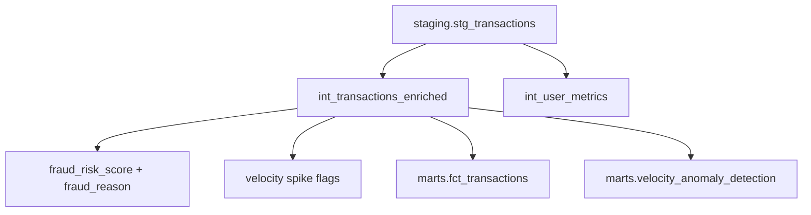

# Intermediate Data Dictionary

| | |
|--|--|
| **Version** | 1.2 |
| **Last updated** | 14 June 2026 |
| **Owner** | Chandan Sahu |
| **Reviewer** | - |

---

## Executive Summary

Intermediate is where **fraud intelligence is computed** - velocity windows, composite risk scores (0-100), and explainable `fraud_reason` strings. Every high/critical transaction on the dashboard traces back to logic defined here.

**Audience:** Data engineers tune scoring; analysts consume **marts** for reporting.

---

## Why This Layer Exists

| Reason | Decision / action enabled |
|--------|---------------------------|
| **Compute once, reuse everywhere** | Same score feeds `fct_transactions`, velocity queue, hourly trends |
| **Windowed analytics** | 1h/24h velocity counts require ordered partitions - too heavy for staging views |
| **Explainability** | `fraud_reason` tells ops *why* a txn scored high before Page 06 review |
| **Surrogate keys** | `transaction_sk` / `user_sk` assigned before star-schema marts |

Intermediate models are materialized as **tables** under the `intermediate` schema.



---

## 2. Intermediate Layer Design Principles

- **Enrich before aggregate** - transaction-level logic stays at transaction grain until marts roll up.
- **Reusable fraud features** - velocity counts and risk scores are computed once, consumed by many marts.
- **No direct raw reads** - all models `ref()` staging only.
- **Surrogate keys assigned here** - `transaction_sk` and `user_sk` generated before core marts.
- **Test critical outputs** - score range 0–100, risk level enums, velocity flag booleans.

---

## 3. Intermediate Model Overview

| Model | dbt path | Grain | Materialization |
|-------|----------|-------|-----------------|
| `int_transactions_enriched` | `models/intermediate/int_transactions_enriched.sql` | One row per transaction | Table |
| `int_user_metrics` | `models/intermediate/int_user_metrics.sql` | One row per user | Table |

---

## 4. Model Dictionary

### 4.1 `intermediate.int_transactions_enriched`

**Purpose:** Core fraud intelligence layer. Enriches staging with velocity counts (1h and 24h windows), same-category 24h counts, composite fraud risk score (0–100), risk level, and human-readable `fraud_reason`.

**Key business outputs:**

- Fraud risk score and level per transaction
- Velocity spike flags
- Explainable fraud reason string

#### Inherited columns

All columns from `staging.stg_transactions` pass through unchanged.

#### Added columns

| Column | Type | dbt tests | Description |
|--------|------|-----------|-------------|
| `transaction_sk` | VARCHAR | unique, not_null | Surrogate key for `fct_transactions` |
| `tx_count_1h` | INT | not_null | User txn count in trailing 1-hour window |
| `tx_count_24h` | INT | not_null | User txn count in trailing 24-hour window |
| `tx_same_category_24h` | INT | — | Same user + category txns in 24h window |
| `is_velocity_spike_1h` | BOOLEAN | true/false | `tx_count_1h >= 5` |
| `is_velocity_spike_24h` | BOOLEAN | true/false | `tx_count_24h >= 15` |
| `fraud_risk_score` | INT | 0–100 | Weighted composite score |
| `fraud_risk_level` | VARCHAR | enum | low · medium · high · critical |
| `fraud_reason` | VARCHAR | — | Pipe-separated triggered factors; NULL if none |
| `dbt_updated_at` | TIMESTAMP | — | Model refresh timestamp |

#### Fraud risk score weights

| Signal | Points |
|--------|--------|
| Odd hour (1–5 AM) | 20 |
| High amount (≥ ₹25,000) | 30 |
| Risky category (Travel, Electronics) | 25 |
| Velocity spike 1h (≥ 5 txns) | 15 |
| Velocity spike 24h (≥ 15 txns) | 10 |

**Macro reference:** [`dbt/payment_dbt/macros/fraud_scoring.sql`](../dbt/payment_dbt/macros/fraud_scoring.sql)

#### Risk level bands

| Level | Score range |
|-------|-------------|
| low | &lt; 30 |
| medium | 30 – 49 |
| high | 50 – 69 |
| critical | ≥ 70 |

#### Velocity window logic

PostgreSQL window functions partitioned by `user_id`, ordered by `transaction_ts`:

```sql
RANGE BETWEEN INTERVAL '1 hour' PRECEDING AND CURRENT ROW
RANGE BETWEEN INTERVAL '24 hours' PRECEDING AND CURRENT ROW
```

#### Downstream usage

- `marts.fct_transactions` — slim fact with score columns
- `marts.velocity_anomaly_detection` — ops queue
- `marts.hourly_fraud_trends` — hour × category rollups

---

### 4.2 `intermediate.int_user_metrics`

**Purpose:** User-level aggregate metrics computed from the enriched transaction set. Supports dimension enrichment and future customer analytics extensions.

| Column | Type | dbt tests | Description |
|--------|------|-----------|-------------|
| `user_sk` | VARCHAR | unique, not_null | Surrogate key |
| `user_id` | VARCHAR | unique, not_null | Business key |
| `total_transactions` | INT | not_null | Lifetime transaction count |
| `avg_transaction_amount` | NUMERIC | not_null | Mean transaction amount |
| `total_spend` | NUMERIC | not_null | Sum of all amounts |
| `fraud_count` | INT | not_null | Fraudulent transaction count |
| `first_transaction_date` | TIMESTAMP | not_null | First txn timestamp |
| `last_transaction_date` | TIMESTAMP | not_null | Most recent txn timestamp |
| `unique_categories_used` | INT | not_null | Distinct merchant categories |
| `unique_merchants_used` | INT | not_null | Distinct merchants transacted with |
| `odd_hour_tx_count` | INT | not_null | Transactions in 1–5 AM window |
| `max_fraud_risk_score` | NUMERIC | — | Peak risk score across user history |

#### Downstream usage

- Available for `dim_users` enrichment (future)
- Segment logic primarily implemented in `marts.fraud_customer_segments`

---

## 5. Analytical Coverage

| Business question | Model | Action enabled |
|-------------------|-------|----------------|
| How risky is this transaction? | `int_transactions_enriched` | Route to review when level ≥ high |
| Did the user spike velocity? | `int_transactions_enriched` | Feed Page 06 `action_required` queue |
| Why was the score high? | `int_transactions_enriched` | Ops reads `fraud_reason` before escalation |
| What is user lifetime behaviour? | `int_user_metrics` | Supports segmentation in `fraud_customer_segments` |

---

## 6. Validation

Intermediate is validated through:

- dbt schema tests in [`models/intermediate/_schema.yml`](../dbt/payment_dbt/models/intermediate/_schema.yml)
- Custom singular test: [`tests/assert_fraud_score_range.sql`](../dbt/payment_dbt/tests/assert_fraud_score_range.sql)
- Upstream staging test pass-through

```bash
make build SELECT=intermediate
make test SELECT=intermediate
```

---

## 7. Warehouse Flow Position

```text
staging.stg_transactions
        ↓
intermediate.int_transactions_enriched ──► marts.fct_transactions
        ↓
intermediate.int_user_metrics
```

*Intermediate layer built using dbt-postgres · fraud scoring vars in `dbt_project.yml`*

---

## Version History

| Version | Date | Changes |
|---------|------|---------|
| 1.0 | Jun 2026 | Initial intermediate dictionary and scoring weights |
| 1.1 | 14 Jun 2026 | Why-layer table, decision-oriented coverage, mermaid |
| 1.2 | 14 Jun 2026 | Metadata header, owner/reviewer fields |
