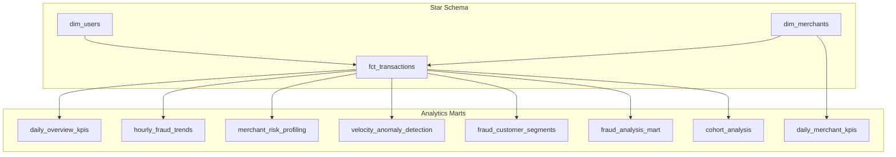
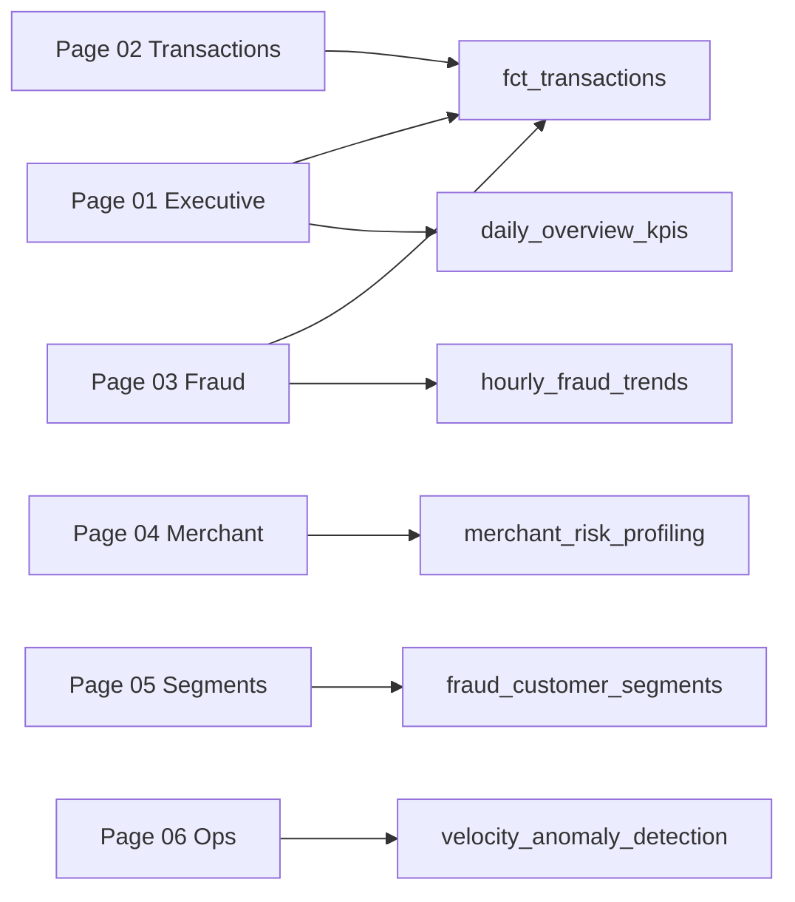
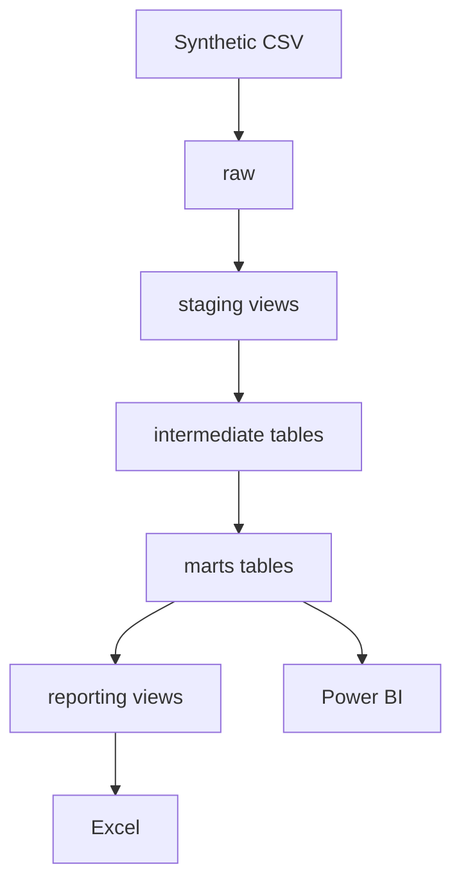

# Marts Data Dictionary

| | |
|--|--|
| **Version** | 1.3 |
| **Last updated** | 14 June 2026 |
| **Owner** | Chandan Sahu |
| **Reviewer** | - |

---

## Executive Summary

`marts` is the **BI consumption layer**: star schema (`dim_users`, `dim_merchants`, `fct_transactions`) plus eight aggregate marts for fraud, merchant risk, velocity, and segments.

**Query rule:** `marts` or `reporting.*` only - never `raw`/`staging`. Ratios via [`sql/`](../sql/) `reporting.*` views. Metrics in [`kpi_definitions.md`](kpi_definitions.md).

---

## 1. Mart Layer Design Principles

The mart layer follows dimensional modeling using:

- **Fact tables** for measurable payment events (`fct_transactions`)
- **Dimension tables** for users and merchants (`dim_users`, `dim_merchants`)
- **Specialized aggregate marts** for fraud, cohort, merchant risk, and velocity workflows

The warehouse supports:

- Star-schema Power BI relationships
- Time-series and MoM reporting via a generated `Date` table in Power BI
- Reusable DAX measures over `fct_transactions`
- Pre-aggregated marts where star-schema rollups would be inefficient (merchant profiling, hourly fraud, velocity queue)

---

## 2. Mart Architecture



**Power BI active relationships:** `Date` → `fct_transactions[transaction_ts]` · `dim_users[user_sk]` → `fct_transactions` · `dim_merchants[merchant_sk]` → `fct_transactions`

---

## 3. Core Fact Table

### 4.1 `marts.fct_transactions`

**dbt model:** `models/marts/core/fct_transactions.sql`  
**Grain:** One row per transaction  
**Source:** `intermediate.int_transactions_enriched` joined to `dim_users` and `dim_merchants`

**Purpose:**

Primary transactional fact table used for:

- GMV and success rate reporting
- Fraud rate and fraud loss KPIs
- Payment method and status analysis
- Risk-level and fraud-reason breakdowns
- MoM time intelligence
- Power BI pages 1-3 and measure backbone across all pages

#### Key business metrics

- Total Transactions · GMV (INR) · Success Rate · Failure Rate
- Fraud Transactions · Fraud Rate · Fraud Loss (INR)
- High Risk Transactions · Avg Fraud Risk Score
- Avg Ticket (INR)

#### Columns

| Column | Description |
|--------|-------------|
| `transaction_sk` | Surrogate primary key |
| `transaction_id` | Unique business transaction identifier |
| `user_sk` | FK → `dim_users` |
| `merchant_sk` | FK → `dim_merchants` |
| `merchant_category` | Category snapshot at transaction time |
| `payment_method` | UPI · Debit Card · Credit Card · Wallet · NetBanking |
| `amount` | Transaction amount in INR |
| `currency` | Currency code (INR) |
| `status` | success · failed · declined · disputed |
| `is_fraud` | Ground-truth fraud label |
| `fraud_risk_score` | Composite score 0–100 |
| `fraud_risk_level` | low · medium · high · critical |
| `fraud_reason` | Pipe-separated triggered risk factors |
| `device_type` | mobile · desktop · POS |
| `city` · `state` | Transaction geography |
| `transaction_ts` | Event timestamp — primary time dimension |
| `raw_loaded_at` | Ingestion timestamp |
| `dbt_updated_at` | Mart refresh timestamp |

> **Note:** `tx_hour`, `transaction_date`, and `is_odd_hour` are **not** persisted on this mart. In Power BI, **`txn_hour`** and **`txn_date`** are calculated columns from `transaction_ts` (used by off-hours DAX). For hour×category heatmaps `hourly_fraud_trends` has been used; for the ops queue `velocity_anomaly_detection` has been used.

#### Downstream usage

- All Power BI transaction measures
- `fraud_analysis_mart`, `daily_*` marts, `merchant_risk_profiling`, `fraud_customer_segments`, `cohort_analysis`

---

## 4. Dimension Tables

### 5.1 `marts.dim_users`

**dbt model:** `models/marts/core/dim_users.sql`  
**Grain:** One row per user

**Purpose:** Customer dimension for geographic slicing, tenure analysis, and star-schema joins.

| Column | Description |
|--------|-------------|
| `user_sk` | Surrogate primary key |
| `user_id` | Stable business key (`USR_XXXXXXXX`) |
| `age_group` | 18-25 · 26-35 · 36-50 · 50+ |
| `account_type` | savings · current · premium |
| `registration_date` | Account registration date |
| `city` · `state` | User geography |
| `days_since_registration` | Tenure in days |

**Downstream:** `fct_transactions`, `fraud_customer_segments`, cohort logic

---

### 5.2 `marts.dim_merchants`

**dbt model:** `models/marts/core/dim_merchants.sql`  
**Grain:** One row per merchant

**Purpose:** Merchant dimension for category risk, geography, and merchant-level drill-down.

| Column | Description |
|--------|-------------|
| `merchant_sk` | Surrogate primary key |
| `merchant_id` | Business key (`MER_XXXXXXXX`) |
| `merchant_name` | Display name |
| `merchant_category` | Business category |
| `city` · `state` | Merchant geography |
| `onboarding_date` | Merchant onboard date |
| `is_high_risk_category` | BOOLEAN — `TRUE` when `merchant_category` IN (`Travel`, `Electronics`) |
| `days_since_onboarding` | Merchant tenure in days |

> **Same rule, different name on transactions:** column `is_risky_merchant_category` on `stg_transactions` (staging). See [`staging_data_dictionary.md`](staging_data_dictionary.md).

**Downstream:** `fct_transactions`, `merchant_risk_profiling`, `daily_merchant_kpis`, `fraud_analysis_mart`

---

## 5. Analytics Mart Tables

### 6.1 `marts.daily_overview_kpis`

**Grain:** One row per calendar day  
**Purpose:** Daily executive rollup for validation cross-checks against star-schema measures.

| Column | Description |
|--------|-------------|
| `day` | Calendar date |
| `total_transactions` | Daily transaction count |
| `active_users` | Distinct users |
| `active_merchants` | Distinct merchants |
| `total_revenue` | Sum of all amounts (all statuses) |
| `avg_transaction_value` | Mean amount |
| `fraud_count` | Fraudulent transactions |
| `fraud_loss_amount` | Sum of fraud amounts |
| `failed_transactions` | Failed status count |

---

### 6.2 `marts.daily_merchant_kpis`

**Grain:** One row per merchant per day  
**Purpose:** Daily merchant performance time series.

| Column | Description |
|--------|-------------|
| `merchant_sk` · `merchant_id` · `merchant_name` | Merchant identity |
| `merchant_category` · `is_high_risk_category` | Category context |
| `day` | Calendar date |
| `transaction_count` | Daily transactions |
| `total_revenue` | Daily revenue |
| `avg_transaction_value` | Mean ticket |
| `fraud_count` · `fraud_loss` | Daily fraud metrics |
| `unique_customers` | Distinct users that day |

---

### 6.3 `marts.cohort_analysis`

**Grain:** One row per cohort month (first **successful** transaction month)  
**Purpose:** Success-based cohort retention and cohort-level fraud metrics.

| Column | Description | Format |
|--------|-------------|--------|
| `cohort_month` | Cohort anchor month | DATE |
| `cohort_size` | Users in cohort | INT |
| `total_transactions` | Lifetime txns in cohort rollup | INT |
| `total_volume` | Lifetime amount | NUMERIC |
| `fraud_rate_pct` | Fraud / all txns × 100 | **0-100** |
| `avg_fraud_risk_score` | Mean risk score | NUMERIC |
| `high_risk_transactions` | high + critical count | INT |
| `retention_1m_pct` · `retention_3m_pct` · `retention_6m_pct` | Mature retention rates | **0-100** |
| `mature_1m_cohort_size` · `mature_3m_cohort_size` · `mature_6m_cohort_size` | Eligible denominators | INT |

**Reporting view:** `reporting.cohort_analysis` adds `retention_*_rate`, `fraud_rate_ratio`

---

### 6.4 `marts.hourly_fraud_trends`

**Grain:** One row per `tx_hour` × `merchant_category` × `payment_method`  
**Purpose:** Hour-of-day fraud concentration for heatmaps and dual-axis charts.

| Column | Description |
|--------|-------------|
| `tx_hour` | Hour 0–23 |
| `merchant_category` | Business category |
| `payment_method` | Payment rail |
| `total_transactions` | Transaction count |
| `fraud_transactions` | Fraud count |
| `fraud_rate_pct` | Fraud rate × 100 |
| `avg_transaction_amount` | Mean amount |
| `avg_fraud_risk_score` | Mean composite score |
| `unique_users` | Distinct users |
| `odd_hour_transactions` | Count in 1–5 AM window |


---

### 6.5 `marts.merchant_risk_profiling`

**Grain:** One row per merchant (all-time rollup)  
**Purpose:** Merchant risk ranking, Top N review lists, and suspend candidate identification.

| Column | Description | Format |
|--------|-------------|--------|
| `merchant_id` · `merchant_name` | Identity | |
| `merchant_category` · `city` · `state` | Attributes | |
| `onboarding_date` | Onboard date | |
| `total_transactions` | Lifetime volume | INT |
| `total_volume` | Lifetime amount (all statuses) | NUMERIC |
| `avg_ticket_size` | Mean transaction amount | NUMERIC |
| `fraud_transactions` | Fraud count | INT |
| `fraud_rate_pct` | NULL when volume &lt; 50 | **0–100** or NULL |
| `avg_fraud_risk_score` | Mean risk score | NUMERIC |
| `high_risk_transactions` | high + critical txns | INT |
| `unique_customers` | Distinct paying users | INT |
| `customer_tx_ratio` | unique_customers / total_transactions | NUMERIC |
| `failed_transactions` | Failed txn count | INT |
| `failure_rate_pct` | Failed / total × 100 | **0–100** |
| `is_rate_reliable` | `total_transactions >= 50` | BOOLEAN |
| `merchant_risk_category` | No Activity · Insufficient Volume · Low/Medium/High Risk | VARCHAR |

**Reporting view:** `reporting.merchant_risk_profiling` adds `fraud_rate_ratio`, `failure_rate_ratio`

---

### 6.6 `marts.velocity_anomaly_detection`

**Grain:** One row per velocity-flagged transaction  
**Purpose:** Operations queue for real-time-style velocity review (batch mart).

| Column | Description |
|--------|-------------|
| `transaction_id` · `user_id` | Identifiers |
| `transaction_ts` · `transaction_date` · `tx_hour` | Time dimensions |
| `merchant_category` · `payment_method` | Context |
| `amount` · `device_type` · `status` | Transaction details |
| `tx_count_1h` · `tx_count_24h` · `tx_same_category_24h` | Velocity counts |
| `velocity_score` | Composite ops priority score |
| `velocity_alert_level` | Low · Medium · High · Critical |
| `is_critical` | Highest-priority boolean |
| `action_required` | Ops action flag |
| `velocity_breach_type` | Breach classification text |
| `fraud_risk_score` · `fraud_risk_level` · `fraud_reason` | Fraud context |
| `is_fraud` | Ground-truth label |

---

### 6.7 `marts.fraud_customer_segments`

**Grain:** One row per user  
**Purpose:** RFM-style segmentation with fraud overlay for customer analytics.

| Column | Description |
|--------|-------------|
| `user_id` | Business key |
| `recency_days` | Days since last transaction |
| `frequency` | Lifetime transaction count |
| `monetary_value` | Lifetime spend (INR) |
| `fraud_count` | Fraudulent transaction count |
| `category_diversity` | Distinct merchant categories used |
| `recency_segment` | Active · Recent · Lapsed · Inactive |
| `frequency_segment` | High / Medium / Low Frequency |
| `monetary_segment` | High / Medium / Low Value |
| `fraud_segment` | **Clean · Single Fraud · Repeat Fraudster** |

---

### 6.8 `marts.fraud_analysis_mart`

**Grain:** One row per transaction  
**Purpose:** Analyst drill-down table - transactions ranked by `fraud_risk_score DESC` with merchant names joined.

---

## 6. Dashboard → Mart Decision Map



---

## 7. Analytical Coverage

| Business decision | Primary models | Action enabled |
|-------------------|------------------|------------|
| Set executive KPI targets | `fct_transactions`, `daily_overview_kpis` | Validate Page 01 cards; cross-check `GMV Variance` |
| Tighten fraud monitoring windows | `hourly_fraud_trends`, `fct_transactions` | Focus 1–5 AM and high-loss categories on Page 03 |
| Prioritise merchant reviews | `merchant_risk_profiling` | Filter `is_rate_reliable = TRUE` before Top N on Page 04 |
| Staff velocity ops | `velocity_anomaly_detection` | Sort by `velocity_score`; action `action_required = TRUE` on Page 06 |
| Segment customers for CRM/risk | `fraud_customer_segments` | Slice `fraud_segment` × `monetary_segment` on Page 05 |
| Deep-dive single transactions | `fraud_analysis_mart` | Rank by `fraud_risk_score` for analyst tables |
| Cohort retention (SQL/interviews) | `cohort_analysis` | Use weighted retention measures — **not** Page 05 chart |
| Payment mix & geography | `fct_transactions`, dims | Slice by `payment_method`, `city`, `merchant_category` |

---

## 8. Power BI & Consumption

Import mode from PostgreSQL.

| Page | Primary marts | Decision focus |
|------|---------------|------------------|
| 01 Executive Summary | `fct_transactions`, `daily_overview_kpis` | Portfolio health + validation |
| 02 Transaction Overview | `fct_transactions` | Volume, success, payment mix |
| 03 Fraud Risk | `fct_transactions`, `hourly_fraud_trends` | Hour/category concentration |
| 04 Merchant Risk | `merchant_risk_profiling` | Review / suspend candidates |
| 05 Customer Analytics | `fraud_customer_segments` | Segments only — no retention chart |
| 06 Operations & Alerts | `velocity_anomaly_detection` | Ops queue |
| 07 Recommendations | — | Limitations narrative |

**Formatting:** `*_pct` columns are 0-100 - divide by 100 in DAX.

---

## 9. Validation and Quality

All mart models are validated through:

- dbt schema tests (`not_null`, `unique`, `accepted_values`, `accepted_range`)
- Custom singular test: `assert_fraud_score_range`
- Upstream staging and intermediate test pass-through
- Full suite: **81/81 PASS** on validated baseline

Mart models are built exclusively from:

- `ref('int_transactions_enriched')`
- `ref('dim_users')`, `ref('dim_merchants')`
- Other mart `ref()` dependencies

No mart model reads directly from `raw` source tables.

```bash
make build    # dbt build - models + tests
make pipeline # dbt build + deploy reporting views
```

---

## 10. Percentage Column Convention

| Consumer | Rule |
|----------|------|
| Power BI Percentage format | Divide `*_pct` by 100 in DAX first |
| `reporting.*` views | Use `*_ratio` columns (pre-divided) |
| Excel | Raw `*_pct` as stored (0–100) |

---

## 11. End-to-End Flow



*Mart layer · dbt-postgres 1.8 · PostgreSQL 16 · 81/81 tests PASS on validated baseline*

---

## Version History

| Version | Date | Changes |
|---------|------|---------|
| 1.0 | Jun 2026 | Initial marts dictionary |
| 1.2 | 14 Jun 2026 | Mermaid architecture, decision-oriented coverage |
| 1.3 | 14 Jun 2026 | Metadata header, concise summary, dashboard decision map |

