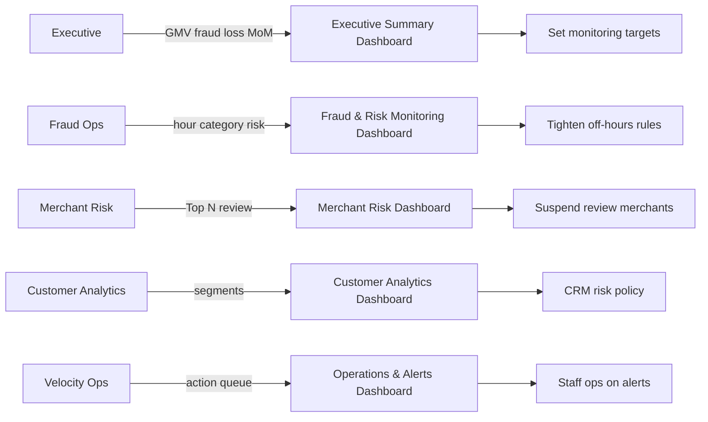
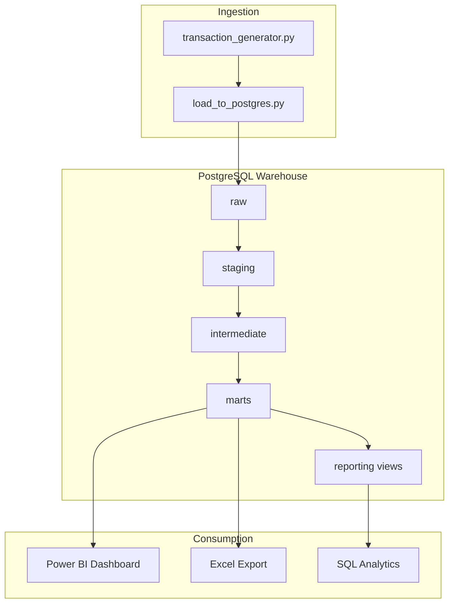

# Problem Statement

| | |
|--|--|
| **Version** | 1.3 |
| **Last updated** | 14 June 2026 |
| **Owner** | Chandan Sahu |
| **Reviewer** | - |

---

## Executive Summary

Fraud and risk detected late-or measured inconsistently-cost payments platforms revenue and trust. This project delivers a **governed PostgreSQL + dbt + Power BI stack** on ~500k synthetic Indian payments so every team shares **one KPI set**.

**Baselines:** Fraud Rate ~**3.5%** · Success Rate ~**92.6%** · Fraud Loss ~**₹88M**

---

## Business Context

Raw transaction logs do not reduce fraud loss by themselves. Without a central warehouse, tested metrics, and role-based dashboards, teams export spreadsheets, debate numbers, and delay merchant reviews.

This platform simulates that end-to-end stack for a UPI/card payments context using synthetic data (Jan 2024–Jun 2025, ~500k transactions).

---

## Core Business Problem

A payments company must answer daily:

- How much GMV did we capture, and how much did fraud cost us?
- Where is fraud concentrated (time, category, payment method)?
- Which merchants should we review or suspend **now**?
- Which transactions need velocity investigation **now**?
- Which customers are high-value vs repeat fraud risk?

**Today’s pain:** Fragmented reports, no shared definitions, slow decisions.  
**Target state:** Single star schema, reusable DAX, ops queue, executive snapshot.

---

## Stakeholders & Pain Points

| Stakeholder | Pain point | What this project delivers |
|-------------|------------|----------------------------|
| **Executive leadership** | No trusted single view of GMV, success, fraud loss |  KPIs + MoM measures |
| **Fraud operations** | Cannot see hour/category concentration quickly | Risk scoring in warehouse |
| **Merchant partnerships & risk** | Ranking merchants on tiny sample sizes | `is_rate_reliable` |
| **Customer analytics** | No segment view of fraud vs value | `fraud_customer_segments` |
| **Operations / velocity** | No prioritised alert queue | `velocity_anomaly_detection` |
| **Data engineering** | Undocumented metrics, brittle SQL | dbt tests, `kpi_definitions.md`, dictionaries |

### Decisions Enabled by Stakeholder

---

## Project Objectives

1. Centralise users, merchants, transactions in PostgreSQL (`raw` → `marts`)
2. Implement fraud risk scoring and velocity detection in dbt
3. Deliver seven-page Power BI dashboard (screenshots in repo; `.pbix` gitignored)
4. Document metrics, limitations, and trade-offs honestly

---

## Platform Architecture

---

## Data Sources

| Source | Records | Role |
|--------|---------|------|
| Synthetic users | 12,000 | `dim_users`, segmentation |
| Synthetic merchants | 600 | `dim_merchants`, merchant risk |
| Synthetic transactions | ~500,000 | `fct_transactions`, all KPIs |

Generator: [`generator/transaction_generator.py`](../generator/transaction_generator.py)  

---

## Business Questions Answered

| # | Question | Where answered (PowerBI Dashboard) |
|---|----------|----------------|
| 1 | GMV, volume, success, fraud loss trends? | Pages 01-02 |
| 2 | Fraud by hour, category, method, risk level? | Page 03 |
| 3 | Which merchants exceed thresholds reliably? | Page 04 |
| 4 | Which txns need velocity review? | Page 06 |
| 5 | Clean vs fraud vs high-value customers? | Page 05 |
| 6 | Do exec KPIs reconcile with daily mart? | Page 01 validation |
| 7 | What should leadership do next? | Page 07 |

---

## Definition of Success (Measurable)

| Criterion | Target | Status |
|-----------|--------|--------|
| Pipeline runs end-to-end | `make pipeline` without errors | Met |
| dbt tests | 81/81 PASS | Met |
| Headline KPI baselines | Fraud Rate ~3.5% · Success Rate ~92.6% · Fraud Loss ~₹88M | Met |
| Dashboard pages | 7 pages with screenshots | Met |
| Metric documentation | `kpi_definitions.md` + dictionaries | Met |
| Known limitations documented | Page 07 + `initial_observation.md` | Met |

---

## Known Trade-offs

| Choice | Sacrifice | Rationale |
|--------|-----------|-----------|
| Synthetic data | Real rail behaviour | Portfolio/demo without live APIs |
| Slim `fct_transactions` | No warehouse `tx_hour` / `transaction_date` | Smaller fact; `txn_hour` + `txn_date` as PBI calc columns |
| `fraud_rate_pct` null &lt;50 txns | Merchant ranking coverage | Statistical honesty |

---

## Out of Scope

- Live payment gateway ingestion  
- Real-time streaming fraud scoring    

---

## Version History

| Version | Date | Changes |
|---------|------|---------|
| 1.0 | Jun 2026 | Initial problem statement |
| 1.2 | 14 Jun 2026 | Stakeholder pain points, architecture diagram, trade-offs |
| 1.3 | 14 Jun 2026 | Metadata header, concise summary, stakeholder decision flow |

