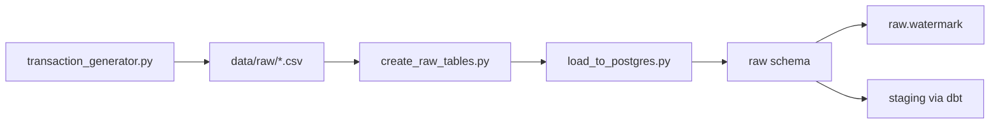

# Raw Data Dictionary

| | |
|--|--|
| **Version** | 1.2 |
| **Last updated** | 14 June 2026 |
| **Owner** | Chandan Sahu |
| **Reviewer** | - |

---

## Executive Summary

The `raw` schema is the **immutable ingestion landing zone** - an exact copy of generator CSVs in PostgreSQL. Nothing is renamed, filtered, or scored here. If downstream KPIs look wrong, engineers replay from `raw` without re-running the generator.

**Do not query `raw` for dashboards** - use `marts` or `reporting.*`.

---

## Why This Layer Exists

| Reason | Decision / action enabled |
|--------|---------------------------|
| **Auditability** | Prove what was loaded vs what dbt transformed - required for KPI disputes |
| **Replay safety** | Rebuild staging → marts after logic changes without regenerating CSVs |
| **Separation of concerns** | Ingestion owns load integrity; dbt owns business rules |
| **Incremental loads** | `watermark` table tracks high-water marks for idempotent batches |
| **Lineage debugging** | Trace a bad dashboard number back to source CSV row |
| **Onboarding** | New engineers validate row counts (500k / 12k / 600) before trusting marts |

**If you skip `raw`:** dbt changes become irreversible without re-ingesting CSVs; fraud KPI baselines cannot be replay-verified.

Tables are created by [`ingestion/create_raw_tables.py`](../ingestion/create_raw_tables.py) and loaded via [`ingestion/load_to_postgres.py`](../ingestion/load_to_postgres.py).



All cleaning, typing, feature flags, and fraud scoring happen in **staging** and **intermediate**. Analytics-ready entities live in **marts**.

---

## 2. Source System Overview

| Source | Type | Tables | Description |
|--------|------|--------|-------------|
| Synthetic generator | Internally generated | 3 tables | Users, merchants, and payment transactions for Indian fintech simulation |
| Ingestion metadata | Pipeline-internal | 1 table | Watermark tracking for incremental loads |

**Generator:** [`generator/transaction_generator.py`](../generator/transaction_generator.py)  

---

## 3. Raw Layer Row Counts (Expected)

| Table | Approximate rows | Description |
|-------|------------------|-------------|
| `raw.users` | 12,000 | Customer master |
| `raw.merchants` | 600 | Merchant master |
| `raw.transactions` | 500,000 | Payment events (Jan 2024 - Jun 2025) |
| `raw.watermark` | 3 | Load metadata per table |

---

## 4. Table Dictionary

### 4.1 `raw.users`

**Source file:** `data/raw/users.csv`  
**Grain:** One row per user  
**Description:** Customer master data for dimension modeling and cohort analysis.

| Column | Type | Nullable | Description |
|--------|------|----------|-------------|
| `user_id` | VARCHAR(20) | No | Primary key. Format `USR_XXXXXXXX`. |
| `age_group` | VARCHAR(10) | No | Demographic band: 18-25, 26-35, 36-50, 50+. |
| `account_type` | VARCHAR(10) | No | savings · current · premium |
| `registration_date` | DATE | Yes | Account registration date. |
| `city` | VARCHAR(50) | Yes | Indian city (10 cities in generator). |
| `state` | VARCHAR(50) | Yes | Indian state mapped from city. |

**Downstream:** `marts.dim_users` via dbt `source('raw', 'users')`

---

### 4.2 `raw.merchants`

**Source file:** `data/raw/merchants.csv`  
**Grain:** One row per merchant  
**Description:** Merchant master for risk profiling and category analysis.

| Column | Type | Nullable | Description |
|--------|------|----------|-------------|
| `merchant_id` | VARCHAR(20) | No | Primary key. Format `MER_XXXXXXXX`. |
| `merchant_name` | VARCHAR(100) | No | Synthetic company name. |
| `merchant_category` | VARCHAR(30) | No | One of 8 business categories. |
| `city` | VARCHAR(50) | Yes | Merchant city. |
| `state` | VARCHAR(50) | Yes | Merchant state. |
| `onboarding_date` | DATE | Yes | Merchant onboarding date. |

**Downstream:** `marts.dim_merchants` via dbt `source('raw', 'merchants')`

---

### 4.3 `raw.transactions`

**Source file:** `data/raw/transactions.csv`  
**Grain:** One row per payment transaction  
**Description:** Central fact source. All fraud labels, statuses, amounts, and timestamps originate here.

| Column | Type | Nullable | Description |
|--------|------|----------|-------------|
| `transaction_id` | UUID | No | Primary key. Unique transaction identifier. |
| `user_id` | VARCHAR(20) | No | FK → `raw.users`. |
| `merchant_id` | VARCHAR(20) | No | FK → `raw.merchants`. |
| `merchant_category` | VARCHAR(30) | Yes | Category snapshot at transaction time. |
| `payment_method` | VARCHAR(20) | Yes | UPI · Debit Card · Credit Card · Wallet · NetBanking |
| `amount` | NUMERIC(12,2) | Yes | Transaction amount in INR. |
| `currency` | VARCHAR(5) | Yes | Default INR. |
| `status` | VARCHAR(20) | Yes | success · failed · declined · disputed |
| `is_fraud` | BOOLEAN | Yes | Synthetic ground-truth fraud label (not ML prediction). |
| `device_type` | VARCHAR(20) | Yes | mobile · desktop · POS |
| `city` | VARCHAR(50) | Yes | Transaction origin city. |
| `state` | VARCHAR(50) | Yes | Transaction origin state. |
| `transaction_ts` | TIMESTAMP | No | Event timestamp — primary time dimension. |
| `created_at` | TIMESTAMP | Yes | Row ingestion timestamp (default CURRENT_TIMESTAMP). |

**Indexes:**

- `idx_transactions_user_id`
- `idx_transactions_merchant_id`
- `idx_transactions_ts`
- `idx_transactions_status`

**Downstream:** `staging.stg_transactions` → full dbt pipeline

---

### 4.4 `raw.watermark`

**Source:** Ingestion pipeline (not CSV)  
**Grain:** One row per loaded table name  
**Description:** Tracks incremental load boundaries for idempotent ingestion.

| Column | Type | Description |
|--------|------|-------------|
| `table_name` | VARCHAR(50) | Primary key — e.g. `transactions` |
| `last_loaded_ts` | TIMESTAMP | High-water mark for incremental filter |
| `rows_loaded` | INT | Rows in last load batch |
| `updated_at` | TIMESTAMP | Last watermark update |

**Managed by:** [`ingestion/watermark.py`](../ingestion/watermark.py)

---

## 5. Schema Relationship Map

```text
raw.users ──────────► raw.transactions ◄────────── raw.merchants
                            │
                            └── (loaded via ingestion, transformed via dbt)

raw.watermark - standalone ingestion metadata
```

---

## 6. Ingestion Commands

```bash
# Generate CSVs
make generate-data

# Create raw tables + load CSVs
make load-data

# Or combined
make ingest

# Full rebuild
make refresh
```

---

## 7. Data Quality Notes

- CSV files are **not committed** to Git (`.gitignore`). Regenerate after clone.
- `is_fraud` is **synthetic ground truth** from the generator - calibrated to headline KPIs: Fraud Rate ~**3.5%**, Success Rate ~**92.6%**, Fraud Loss ~**₹88M**.
- `merchant_category` on transactions is **denormalized by design** - preserves category at txn time.
- `transaction_ts` is proper TIMESTAMP in raw - no VARCHAR-to-timestamp casting required at staging.
- Fraud burst logic and user segments in the generator create **realistic heterogeneity** but **limited MoM trend variation**.

---

## 8. Validation

Raw layer is validated through:

- Foreign key constraints on `raw.transactions`
- Generator row-count targets (500k / 12k / 600)
- Downstream dbt `not_null`, `unique`, and `accepted_values` tests on staging

No analytics or dashboards should query `raw` directly - use `marts` or `reporting` views.

---

## Version History

| Version | Date | Changes |
|---------|------|---------|
| 1.0 | Jun 2026 | Initial raw table dictionary |
| 1.1 | 14 Jun 2026 | Why-layer table, ingest mermaid |
| 1.2 | 14 Jun 2026 | Metadata header, strengthened why-layer, locked baselines |

