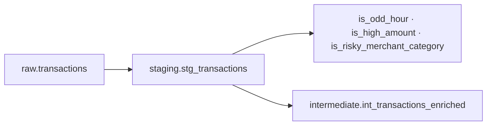

# Staging Data Dictionary

| | |
|--|--|
| **Version** | 1.2 |
| **Last updated** | 14 June 2026 |
| **Owner** | Chandan Sahu |
| **Reviewer** | - |

---

## Executive Summary

Staging is the **hygiene and feature-engineering boundary** between raw ingestion and fraud logic. It standardises types, renames for clarity, and derives hour/amount/category flags once - so intermediate models and marts never duplicate off-hours or risky-category rules.

**Grain preserved:** one row per transaction, no joins, no aggregations.

---

## Why This Layer Exists

| Reason | Decision / action enabled |
|--------|---------------------------|
| **Single source of fraud flags** | `is_odd_hour`, `is_high_amount`, `is_risky_merchant_category` defined once in `dbt_project.yml` vars |
| **Type safety** | Timestamps and dates are cast before window functions in intermediate |
| **Testable contracts** | dbt tests on staging catch bad generator output before scoring runs |
| **Slim facts** | Hour columns stay here (and downstream marts) — not bloating `fct_transactions` |

All staging models are materialized as **views** under the `staging` schema. **Not for dashboard consumption** - debug and pipeline validation only.

---

## 2. Staging Layer Design Principles

- **One staging model per raw source table** (currently transactions only flow through staging; users/merchants are sourced directly to dims from raw).
- **Rename only when clarity improves** (`created_at` → `raw_loaded_at`).
- **Cast types explicitly** - timestamps and dates must be query-safe.
- **Derive analytical flags early** - odd hour, high amount, risky category - so intermediate models reuse consistent logic.
- **Apply dbt tests** - `not_null`, `unique`, `accepted_values`, `accepted_range` on critical columns.

---

## 3. Staging Model Overview

| Model | dbt path | Source | Grain | Materialization |
|-------|----------|--------|-------|-----------------|
| `stg_transactions` | `models/staging/stg_transactions.sql` | `raw.transactions` | One row per transaction | View |

**Downstream:**

- `intermediate.int_transactions_enriched`
- `intermediate.int_user_metrics`

---

## 4. Model Dictionary

### 4.1 `staging.stg_transactions`

**Purpose:** Standardize transaction data and add fraud-detection feature flags used in composite risk scoring.

**Transformation tags applied:**

| Tag | What changes from raw |
|-----|----------------------|
| `cast_timestamp` | Ensures `transaction_ts` is typed TIMESTAMP |
| `derive_date` | Adds `transaction_date` from `transaction_ts` |
| `derive_hour` | Adds `tx_hour` (0–23) and `tx_day_of_week` (0–6) |
| `fraud_flags` | Adds `is_odd_hour`, `is_high_amount`, `is_risky_merchant_category` |
| `rename` | `created_at` → `raw_loaded_at` |

#### Source columns (preserved from raw)

| Column | Type | dbt tests | Description |
|--------|------|-----------|-------------|
| `transaction_id` | UUID | unique, not_null | Primary business key |
| `user_id` | VARCHAR | not_null | User reference |
| `merchant_id` | VARCHAR | not_null | Merchant reference |
| `merchant_category` | VARCHAR | not_null | Merchant category at txn time |
| `payment_method` | VARCHAR | not_null | Payment rail |
| `amount` | NUMERIC | not_null | Amount in INR |
| `currency` | VARCHAR | not_null | Currency code |
| `status` | VARCHAR | not_null | success · failed · declined · disputed |
| `is_fraud` | BOOLEAN | not_null | Ground-truth fraud label |
| `device_type` | VARCHAR | - | mobile · desktop · POS |
| `city` | VARCHAR | - | Transaction city |
| `state` | VARCHAR | - | Transaction state |
| `transaction_ts` | TIMESTAMP | not_null | Event timestamp |
| `raw_loaded_at` | TIMESTAMP | - | Ingestion timestamp |

#### Derived columns

| Column | Type | dbt tests | Description |
|--------|------|-----------|-------------|
| `transaction_date` | DATE | not_null | Date cast from `transaction_ts` |
| `tx_hour` | INT | 0-23 range | Hour of day (PostgreSQL `EXTRACT(HOUR ...)`) |
| `tx_day_of_week` | INT | 0-6 range | 0=Sunday through 6=Saturday |
| `is_odd_hour` | BOOLEAN | true/false | `TRUE` when hour between **1 AM and 5 AM** inclusive |
| `is_high_amount` | BOOLEAN | true/false | `TRUE` when `amount >= 25000` INR |
| `is_risky_merchant_category` | BOOLEAN | true/false | `TRUE` for Travel, Electronics |

#### dbt project variables

| Variable | Default | Rule |
|----------|---------|------|
| `odd_hour_start` | 1 | Off-hours lower bound (hour) |
| `odd_hour_end` | 5 | Off-hours upper bound (hour) |
| `high_amount_threshold` | 25000 | High-amount flag threshold (INR) |
| `risky_merchant_categories` | Travel, Electronics | Categories flagged as risky |

Defined in [`dbt/payment_dbt/dbt_project.yml`](../dbt/payment_dbt/dbt_project.yml).

#### Downstream usage

| Consumer | Uses staging for |
|----------|------------------|
| `int_transactions_enriched` | Velocity windows + fraud score on top of flags |
| `hourly_fraud_trends` | Hour × category fraud aggregations (via intermediate) |
| `velocity_anomaly_detection` | Ops queue with `tx_hour` exposed |

#### Same idea, different column name elsewhere

| Rule | Here (`stg_transactions`) | Elsewhere |
|------|---------------------------|-----------|
| Travel / Electronics risky | `is_risky_merchant_category` | `is_high_risk_category` on `dim_merchants` |
| 1–5 AM | `is_odd_hour` | PBI: filter `txn_hour` IN {1-5} on `fct_transactions`; or `hourly_fraud_trends` / `velocity_anomaly_detection` |
| Hour 0–23 | `tx_hour` | PBI calc `txn_hour`; also on `hourly_fraud_trends`, `velocity_anomaly_detection` |

#### Power BI note

`fct_transactions` has no warehouse `tx_hour`, `txn_date`, or `is_odd_hour`. The Power BI model adds **`txn_hour`** and **`txn_date`** as calculated columns from `transaction_ts` - use these for DAX on the fact table. For pre-aggregated hour×category views or the velocity queue, use `hourly_fraud_trends` or `velocity_anomaly_detection`.

---

## 5. Staging vs Raw — Summary

| Aspect | Raw | Staging |
|--------|-----|---------|
| Column names | As generated | `created_at` renamed |
| Timestamps | Typed | Confirmed + `transaction_date` derived |
| Fraud features | None | Three boolean flags + hour fields |
| Joins | None | None |
| Dashboard use | Never | Rarely (debug only) |

---

## 6. Validation

Staging is validated through dbt schema tests in [`models/staging/_schema.yml`](../dbt/payment_dbt/models/staging/_schema.yml):

- Primary key uniqueness on `transaction_id`
- `not_null` on all critical business columns
- `accepted_range` on `tx_hour` and `tx_day_of_week`
- `accepted_values` on boolean flags

Run: `make build`

---

## Version History

| Version | Date | Changes |
|---------|------|---------|
| 1.0 | Jun 2026 | Initial staging model dictionary |
| 1.1 | 14 Jun 2026 | Why-layer table, staging flow mermaid |
| 1.2 | 14 Jun 2026 | Metadata header, decisions-enabled line, PBI txn_hour note |
